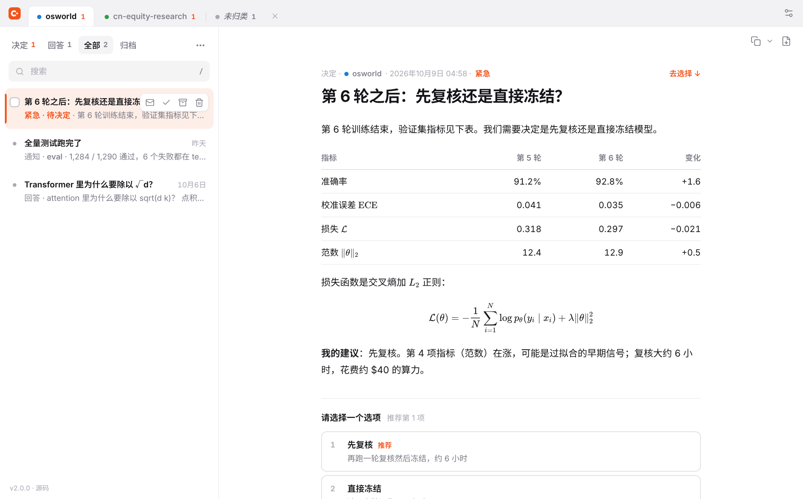

# ClaudeDesk

English · [中文](README.zh-CN.md)

A small Windows tray app that gives Claude Code sessions a place to reach you, outside the terminal:

- **Decisions.** Instead of the built-in AskUserQuestion prompt, a session posts a decision with options. You pick one (and optionally add a note) in ClaudeDesk; the session, waiting in the background, wakes up and carries on.
- **Answers.** When you ask a session a question, it answers in the chat *and* posts the question plus the full answer here, so it doesn't get buried under tool output.
- **Info.** Occasional notices ("the long run finished", "a job crashed").

Bodies are full Markdown: tables, highlighted code and LaTeX math (`$…$`, `$$…$$`, `\(…\)`, `\[…\]`). Every message can be copied in one click (Markdown, rich text or plain text) or exported to PDF, then archived or deleted.



> Third-party tool. Not affiliated with or endorsed by Anthropic. The interface is in Simplified Chinese.

## Install

Windows 10/11 (Edge WebView2 is built in).

1. Download `ClaudeDesk.exe` from [Releases](https://github.com/tsljgj/ClaudeDesk/releases/latest) into a folder you can write to, e.g. `%LOCALAPPDATA%\Programs\ClaudeDesk\` (not `Program Files`, or it can't update itself).
2. Run it. It puts `desk.py` (the CLI Claude uses) and `data\` (your inbox) next to itself.
3. Copy [`skill/claude-desk/SKILL.md`](skill/claude-desk/SKILL.md) to `~/.claude/skills/claude-desk/SKILL.md` and set `DESK` to that `desk.py` and `PY` to your Python 3.10+. Optionally make it a standing rule in `~/.claude/CLAUDE.md`:

   ```markdown
   ## Talking to the user: ClaudeDesk
   - For anything the user must decide, don't use AskUserQuestion: post a decision with skill claude-desk and wait for it in the background.
   - When answering a user's question, answer in the chat and also post it to ClaudeDesk as an answer (original question + full answer).
   ```

Upgrading from 1.x: quit the old app from the tray, drop the new `ClaudeDesk.exe` into the old folder; `data\` carries over and the old `_internal\` folder can go.

**Self-update** works like [agent-management](https://github.com/tsljgj/agent-management): every green CI build on `main` or `claude/*` is published as a `build-<N>` release with `ClaudeDesk.exe` and its `.sha256`. The app checks ~45 s after start and then every 6 hours, downloads and verifies the new exe, renames itself to `ClaudeDesk.exe.old` (Windows allows renaming a running exe), puts the new one in place, starts it and exits. It never restarts under you while the window is open: it waits until you close it to the tray, or you click "更新到 build N" in the bottom-left corner. The bundled `desk.py` is refreshed at the same time. Turn it off under Settings or in the tray menu.

## Using it

- Four views at the top: **决定** (decisions; the orange number counts unanswered ones), **回答** (answers), **全部** (everything), **归档** (archive).
- **Per repo (tabs across the top of the window):** the tabs are repo names. Click one to see only that repo, click it again (or ×, or `Esc`) to see all; `Ctrl`/`Shift`-click to pick several; `[` / `]` switch. The repo comes from `desk.py post`, which records the git repo of the directory it runs in (origin URL name; worktrees resolve to their repo; outside git, the folder name; `--repo` overrides). Messages from before this version are matched to repos found in Claude Code's own session history (`~/.claude/projects`, plus `CLAUDE_CONFIG_DIR`); anything left over goes under "未归类", where "归到…" files it under a repo.
- Decisions: press `1`–`9` or click an option, optionally type a note, `Ctrl+Enter` to submit.
- Hover a message in the list to get its own actions (read/unread, mark resolved, archive, delete) and a checkbox; nothing shows until you hover. The open message has an orange bar on its left.
- **Mark resolved** (`R`) tells a waiting session the matter is handled, without picking an option (`"resolved": true` in the reply). Archiving or deleting a still-open decision tells it you skipped it, so it never hangs.
- Tick checkboxes (`Shift` for a range, `X`, `Ctrl+A`) for the batch bar: select all, read, resolved, archive, delete. Right-click works too.
- The reader toolbar has copy (Markdown; the arrow offers rich text / plain text) and PDF. Search with `/`. Press `?` for all shortcuts.
- Settings: light / dark / system theme, four accent colors, sans (Inter + Noto Sans SC) or serif (Source Serif + Noto Serif SC) reading font, text size, list density, start with Windows, auto-update.

## Run from source / build

```bat
pip install -r requirements.txt
cd src && python -m claudedesk            :: tray + window
cd src && python -m claudedesk --serve    :: local server only; open it in any browser (any OS)
build.cmd [-Install]                      :: one-file ClaudeDesk.exe (build 0: no self-update)
```

The window is a local web page shown in Edge WebView2 via pywebview, with a pystray tray icon. Markdown is rendered by markdown-it + DOMPurify + KaTeX + highlight.js, all bundled for offline use along with the fonts (`scripts/vendor.py`). The local server binds to 127.0.0.1, checks the Host header and requires a per-launch token. Tests in `tests/` drive the real UI in Chromium via Playwright; CI also self-tests the packaged exe and runs an end-to-end post → reply → self-update on Windows.

## CLI reference (`desk.py`)

```bash
PY=python
DESK=C:/path/to/ClaudeDesk/desk.py

# Post a decision; prints the new message id. Body is a UTF-8 Markdown file.
"$PY" "$DESK" post --kind decision --source my-project --title "Review before freezing?" \
    --body-file plan.md --option "Freeze now::2 hours" --option "Review first::about 6 hours" \
    --recommended 2 --allow-text [--priority high]

# Block until you reply (run in the background). Exit 0 with the reply JSON; exit 2 on --timeout.
"$PY" "$DESK" wait --source my-project --id <id> [--timeout SECONDS]

# Post an answer: your original question plus the full answer.
"$PY" "$DESK" post --kind answer --source my-project --title "Do the two config dirs sync?" \
    --question "If I edit a skill in one, does the other change?" --body-file answer.md

# Other
"$PY" "$DESK" post --kind info --source X --title "Run finished" --body "Results in ..."   # --body - reads stdin
"$PY" "$DESK" responses [--source X] [--id ID] [--since ISO_TIMESTAMP]
"$PY" "$DESK" list [--open] [--source X] [--json]
"$PY" "$DESK" close --id <id> --text "User answered in chat: B"   # mark a decision handled
```

- `post` starts ClaudeDesk (minimized) if it isn't running; `--no-launch` turns that off.
- `--recommended` is a 1-based option index. Options are `"label::description"`; the description is optional. A decision with no options accepts a free-text reply.
- Data lives in `data/` next to `desk.py`. Override with `--data DIR` (before the subcommand) or the `CLAUDEDESK_DATA` environment variable; the app accepts the same.

A reply looks like:

```json
{"id": "20261003-181209-abb336", "ts": "2026-10-03T18:20:01.512-04:00", "choice": "Review first",
 "text": "only check G4", "source": "my-project", "title": "Review before freezing?", "choice_index": 2}
```

File formats and concurrency details are documented in the [Chinese README](README.zh-CN.md).

## License

[MIT](LICENSE). Bundled front-end libraries and fonts: see `src/claudedesk/assets/vendor/LICENSES.txt`.
